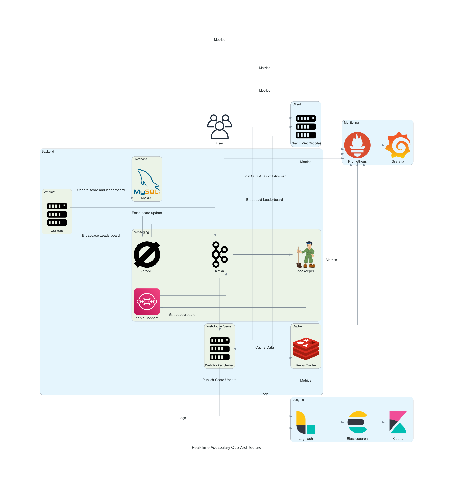
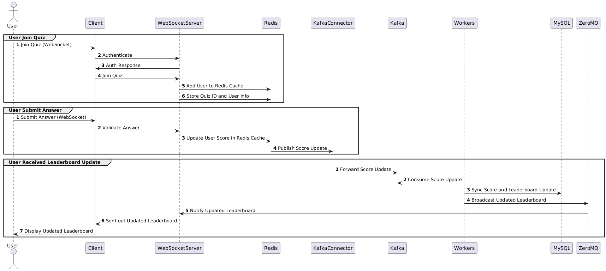

# Real-Time Vocabulary Quiz Application

## Overview

Welcome to the Real-Time Vocabulary Quiz Application! This project is designed to provide a real-time quiz feature for an English learning application. Users can answer questions in real-time, compete with others, and see their scores updated live on a leaderboard.

## Requirements

[Requirements](requirements.md)

## Features

- **User Participation**: Users can join a quiz session using a unique quiz ID.
- **Real-Time Score Updates**: Users' scores are updated in real-time as they submit answers.
- **Real-Time Leaderboard**: A leaderboard displays the current standings of all participants, updated promptly as scores change.

## Architecture



## Sequence Diagram



### Components

1. **User**: Interacts with the client (web or mobile) application.
2. **Client**: Handles user requests and communicates with the WebSocket server.
3. **WebSocket Server**: Manages real-time communication, validates user actions, and updates scores.
4. **Redis Cache**: Stores frequently accessed data, such as user scores and quiz information.
5. **Kafka Messaging**: Handles real-time score updates and forwards them to MySQL for persistent storage via Kafka Connect.
6. **MySQL Database**: Stores all persistent data, including user information, quizzes, and scores.
7. **Zookeeper**: Coordinates the Kafka messaging system.

## Getting Started

### Prerequisites

- Docker and Docker Compose
- (Optional) Postman

### Installation

1. **Clone the repository**:

   ```sh
   git clone https://github.com/phongln/elsa-real-time-quiz.git
   cd real-time-quiz
   ```

2. **Set up environment variables**:
   - Clone a `.env.local` file in the project root to `.evn`

3. **Run Docker Compose**:

   ```sh
   docker-compose up -d
   ```

4. **Initialize the database**:
   - Run the MySQL container and execute the schema.sql file to set up the database schema.

### Running the Application

   **Build and run the Go application**:

```sh
go build -o main ./cmd/main.go
./main
```

1. **Access the application**:

- The WebSocket server will be available at ws://localhost:8080/ws.
- Metrics can be accessed at <http://localhost:8080/metrics>.

### Usage

```
- After `docker-compose up -d`, please wait for awhile before starting due to the Kafka upstream and election
- Join connections via ws://localhost:8080/ws
```

1. **Joining Quiz**:

- Make websocker call to ws://localhost:8080/ws with the following parameters

   ```json
   {
      "user_id": 1,
      "quiz_id": 1
   }
   ```

2. **Submit answer**:

- Make websocker call to ws://localhost:8080/ws with the following parameters

   ```json
   {
      "answer": "dummy answer",
      "score": 10
   }
   ```

### Monitoring and Logging

- Grafana: Visualize metrics collected by Prometheus.
- Prometheus: Collects and stores metrics from the WebSocket server.
- ELK Stack:
  - Logstash: Collects logs from the WebSocket server and forwards them to Elasticsearch.
  - Elasticsearch: Indexes and stores the logs.
  - Kibana: Visualizes the logs for analysis and debugging.
